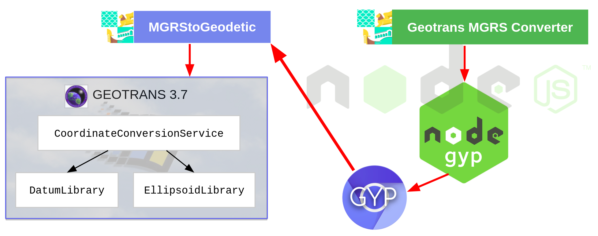

Geotrans MGRS Converter:
=======================

The Geotrans MGRS Converter is a NodeJS module that utilizes the [Node-gyp](https://github.com/nodejs/node-gyp) library to call a custom MGRS-to-Geodetic-Coordinates script written using Geotrans C++ library.

This code has not been tested in Windows.




Running via Docker:
=======================

### Requirements
   * Docker
   
### Build

Run `docker build -t mgrs-converter .` in the geotrans-mgrs-converter/ folder.

### Run

Run `docker run -it -p 3150:3150 -d mgrs-converter`

### Test

Call GET via browser or cURL on `localhost:3150?datum={DATUM}&coord={COORDINATE}`.

**{DATUM}** = *WGE (Default, WGS84)||WGC||FOT||ARF-G||INF-A||INH-A *

**{COORDINATE}** = *MGRS coordinate, expressed in (grid zone designator, GZD) +  (100 km Grid Square ID) + (Numerical Location, 2 digits minimum).*


Running natively:
=======================

### Requirements
   * `python` (`v2.7` recommended, `v3.x.x` is __*not*__ supported)
   * `make`
   * A proper C/C++ compiler toolchain, like [GCC](https://gcc.gnu.org)
   * NodeJS
   
### Pre-installation Scripts

Run the `download_geotrans.sh` script. This will install the remainder of the Geotrans library not included in this repository due to file size constraints.

Run the `install.sh` script using `source` instead of `./`. This will set environmental variables accordingly.

### Configuring Node-gyp

If you have multiple Python versions installed, you can identify which Python
version `node-gyp` uses by setting the '--python' variable:

``` bash
$ node-gyp --python /path/to/python2.7
```

If `node-gyp` is called by way of `npm` *and* you have multiple versions of
Python installed, then you can set `npm`'s 'python' config key to the appropriate
value:

``` bash
$ npm config set python /path/to/executable/python2.7
```

### Compiling Geotrans and Node bindings

Generate the appropriate project build files for the current
platform. Use `configure` for that:

``` bash
$ node-gyp configure
```
Next invoke the `build` command:

``` bash
$ node-gyp build
```
### Run the converter

`test.js` will run the converter on a sample MGRS coordinate. If this fails, try running the commands in `install.sh` manually. Missing environmental variable definitions pointing to the Geotrans data directory (`geotrans3.7/data`) result in `aborted (core dumped)` error.  

Here is an example of the GeotransMgrsConverter in use with the WGS84 datum (specified as `"WGE"` in Geotrans) and the MGRS string `"12UUA8432340791"` (randomly-picked location appr. 80 miles SE of Calgary, Alberta, Canada).

```javascript
const converter = require("path/to/geotransMgrsConverter");

let myConverter = new converter("WGE");

myConverter.convert("12UUA8432340791")`

```

The result will be a GeoJSON object as such:
```javascript
{
  "type": "Feature",
  "geometry": {
    "type": "Point",
    "coordinates": [
      50.00105275281522,
      -112.61869345019069
    ]
  },
  "properties": {
    "name": "12UUA8440"
  }
}
```
  
**NOTE**: If you plan on using the original C++ method, keep in mind that Geotrans returns radians. The Radian->Dec. Deg. conversion in this module is done in JavaScript.
